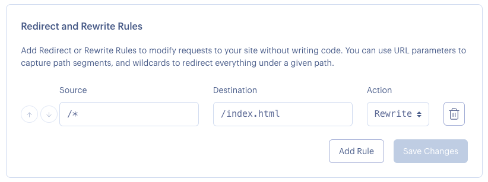
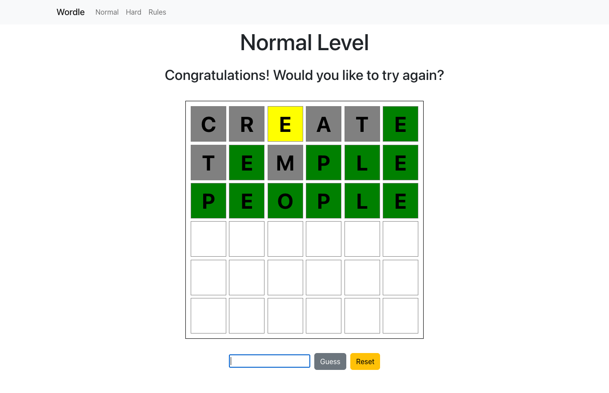

# Wordle Game

This is a wordle game built with React

https://yesheng-liu-yuxuan-lin-project2.onrender.com/

There are two levels of difficulty
1. Normal - 6 letter words with 6 max attempts
2. Hard - 7 letter words with 5 max attempts

Also, this app is optimized for mobile view

## Implementation

* React - create reusable app components
* React Hooks - control the state of variables across web pages
* React Router - navigation across web pages
* Bootstrap - ensure the consistent design of the whole web app
* Vite - simplify the build/test process
* render - provide easy deployment of React app

## Deployment

This project is deployed on render.com, with following customized settings

```
environment: node
build command: npm run build
publish directory: dist
```

### More configurations

*Rewrite Rules*

## Screenshots

*gameplay*

## Collaborators
Yesheng Liu, Yuxuan Lin